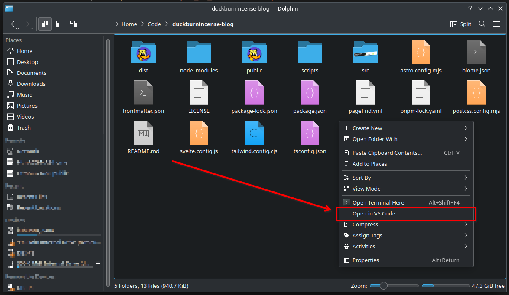
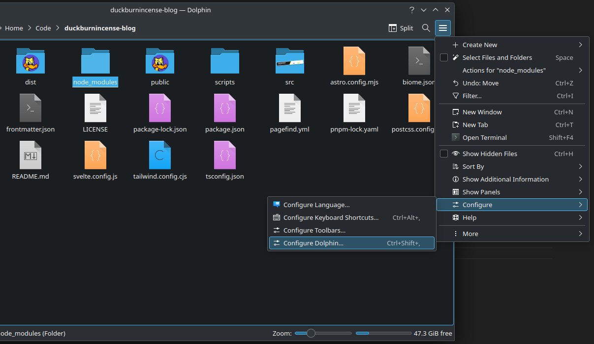
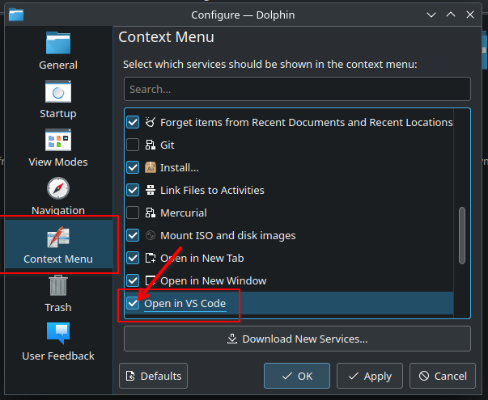

每次想在指定目录下打开 VS Code 都得用 Open Terminal Here 选项开一个终端, 再敲 `code .` 来在当前目录下打开 VS Code, 实在是太不方便了. 有没有方法直接往右键菜单塞东西呢?

有的兄弟有的, 根据 [KDE Dolphin 文档](https://develop.kde.org/docs/apps/dolphin/service-menus/), 我们可以往 `~/.local/share/kservices5/ServiceMenus/` 里面塞一个 `desktop` 文件, 按照文档中说明的格式写好后, 就能在右键菜单里新增一个选项了.

以下是教程:

(下面的方法仅在 `Dolphin Version 23.08.5`, `KDE Plasma Version 5.27.12` 测试过, 不保证通用性)

1. 如果文件夹不存在 (默认不存在), 创建一下

```bash
$ mkdir -p ~/.local/share/kservices5/ServiceMenus/
```

2. 新增一个 `desktop` 文件, 这里我就叫 `open_in_vscode.desktop` 了

```bash
$ vim ~/.local/share/kservices5/ServiceMenus/open_in_vscode.desktop
```

3. 写入下列内容

```ini
[Desktop Entry]
Type=Service
ServiceTypes=KonqPopupMenu/Plugin
MimeType=inode/directory;
Actions=openinvscode
X-KDE-Priority=TopLevel

[Desktop Action openinvscode]
Name=Open in VS Code
Icon=code
Exec=code "%u"
```

完成, 就是这么简单, 现在在 Dolphin 里右键, 应该能看到一个叫做 `Open in VS Code` 的选项:



如果没看到的话, 可以在 Dolphin 设置里修改: 





终于不用再敲 `code .` 了~
