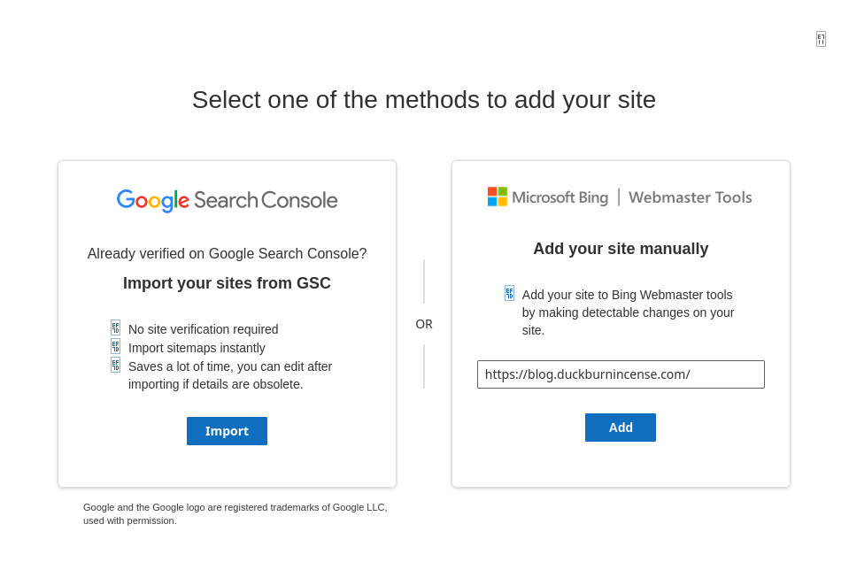
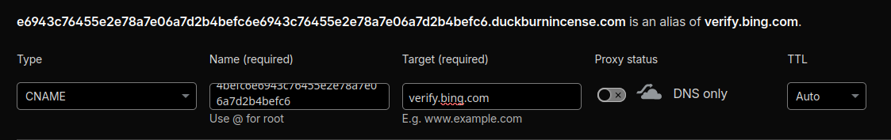
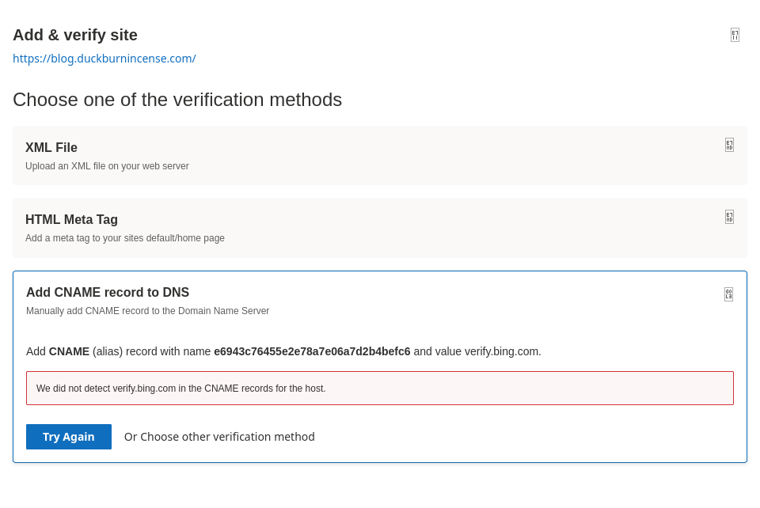
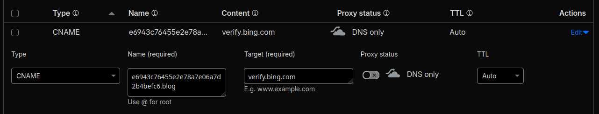

闲着没事想给本站搞个搜索引擎收录, 由于以前有过在 [Bing Webmaster Tools](https://www.bing.com/webmasters/) 提交网站的经验, 于是首选了 bing.

这里因为要收录 `blog.duckburnincense.com`, 因此当然是直接填写:

然后来到验证页面, 三种验证方式, 因为我这是自动构建的静态网站, 若选择前两种验证方案, 我还得修改网站内容, 重新 push 到 GitHub, 再自动 build 才能用. 因此我选择了向 DNS 中添加 CNAME 记录来验证.

页面要求向 DNS 中添加一条名为 `e6943c76455e2e78a7e06a7d2b4befc6e6943c76455e2e78a7e06a7d2b4befc6` 的, 指向 `verify.bing.com` 的 CNAME 记录, 因此, 我理所应当地添加了 DNS 记录:

随后等待一段时间, 点击提交验证按钮, 提示未找到 CNAME 记录. 此时我还以为是 DNS 还未传播, 于是随后多次等待, 提交, 均无果:

然后我突然想起来, 我加的是 `blog.duckburnincense.com` 而不是 `duckburnincense.com`, 因此应该向 `blog.duckburnincense.com` 添加 CNAME 记录, 因此 DNS 管理器中的 name 中应该填写 `e6943c76455e2e78a7e06a7d2b4befc6e6943c76455e2e78a7e06a7d2b4befc6.blog`:

随后再次点击验证按钮, 验证成功.
