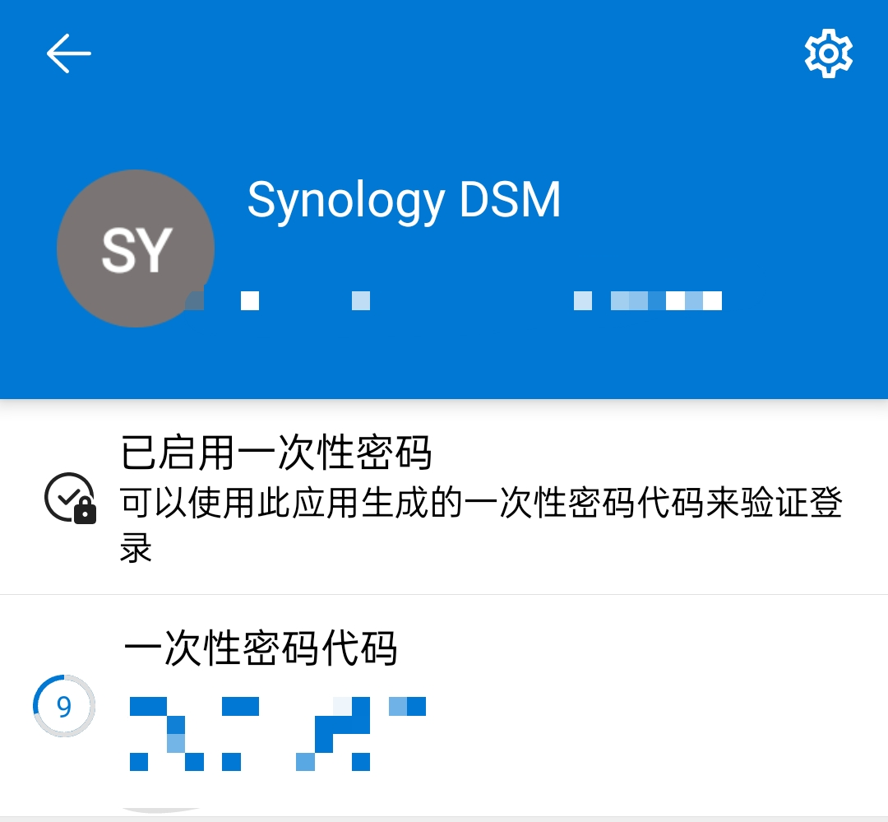

**注意: 此方法需要你具有你的手机的 root 权限**

我在电脑上一直用浏览器拓展 ["Authenticator"](https://github.com/Authenticator-Extension/Authenticator) 来管理 2FA 密钥, 然而前日我在新电脑上登了 Firefox 账号, 并删除了 Firefox 自动同步到新电脑上的 Authenticator 拓展 (因为我觉得我在这个电脑上并不需要 Authenticator), 然而 Firefox 又将 "删除 Authenticator 拓展" 这一行为同步到了旧电脑上, 于是我在电脑上的 2FA 就丢失了...

好在我手机上的 Microsoft Authenticator 还存在 2FA 的 TOTP 代码, 可是 MS Authenticator 官方似乎并没有提供导出密钥的方法, 不过还好, 我有 root 权限. 于是我们尝试直接读取其数据库获得密钥.

#### 第一步: 连上手机, 获得 root shell:

在手机 root 管理器中启用 Shell 的 root 权限, 随后 adb 连接到手机:

```sh
$ adb shell
phone:/ $ su
```

#### 第二步: 找到存储密钥的数据库

不难想到, 这么机密的东西, 肯定是存储在应用私有目录下的

```sh
phone:/ # cd /data/data/com.azure.authenticator/
```

可是这么多数据, 哪个里面才存了真实密钥呢?

不妨将页面上显示的账户名中的 `DSM` 作为关键词搜索:



```sh
phone:/data/data/com.azure.authenticator # grep -r "DSM" . | head -n 1
Binary file ./databases/PhoneFactor-wal matches
```

找到了 `/data/data/com.azure.authenticator/databases/PhoneFactor-wal`, 里面疑似存储着密钥

#### 第三步: 打开数据库

猜测这是一个数据库文件, 于是试图直接打开该文件, 未果, 那么看看 `./databases/` 下还有啥:

```sh
phone:/data/data/com.azure.authenticator # ls ./databases/
AppIdDomainMapping             LabellingData-wal       VerifiableCredential-wallet-db                   experimentation_database           passkey_database_table-wal
AppIdDomainMapping-shm         MfaLibrary              VerifiableCredential-wallet-db-shm               experimentation_database-shm       payment_card_db
AppIdDomainMapping-wal         MfaLibrary-shm          VerifiableCredential-wallet-db-wal               experimentation_database-wal       payment_card_db-shm
AriaStorage.db                 MfaLibrary-wal          app_policy_database                              generator_history_db               payment_card_db-wal
AriaStorage.db-journal         PUDSSchemaDatabase      app_policy_database-shm                          generator_history_db-shm           shared_core_database
EnterpriseDenyListMapping      PUDSSchemaDatabase-shm  app_policy_database-wal                          generator_history_db-wal           shared_core_database-shm
EnterpriseDenyListMapping-shm  PUDSSchemaDatabase-wal  com.google.android.datatransport.events          google_app_measurement.db          shared_core_database-wal
EnterpriseDenyListMapping-wal  PhoneFactor             com.google.android.datatransport.events-journal  google_app_measurement.db-journal
LabellingData                  PhoneFactor-shm         com.microsoft.appcenter.persistence              passkey_database_table
LabellingData-shm              PhoneFactor-wal         com.microsoft.appcenter.persistence-journal      passkey_database_table-shm
```

注意到, 该目录下还有 `PhoneFactor` 文件, 并且通过十六进制编辑器查看, 很明显这是一个 Sqlite 3 数据库

于是**单独**将 `PhoneFactor` 复制到电脑并打开. `accounts` 表共有五条记录, 其他 2FA 密钥都在里面, 唯独没有 "DSM" 那条密钥

猜测其与 `PhoneFactor-shm` 和 `PhoneFactor-wal` 文件是一对, 需要同时打开. 前往 Sqlite 官网查找[文档](https://www.sqlite.org/fileformat2.html), 确认了猜测:

> 4.6. WAL-Index Format
> Conceptually, the wal-index is shared memory, though the current VFS implementations use a memory-mapped file for operating-system portability. The memory-mapped file is in the same directory as the database and has the same name as the database with a "-shm" suffix appended. Because the wal-index is shared memory, SQLite does not support journal_mode=WAL on a network filesystem when clients are on different machines, as all clients of the database must be able to share the same memory.
> ...

简而言之

- `-wal` 文件‌: 保存未提交的写操作日志, 支持多线程并发写入, 避免传统日志锁定. 当数据库崩溃时, 可通过 WAL 文件恢复未提交的更改.
- `‌-shm` 文件: 共享内存文件, 用于协调多线程对 WAL 文件的访问, 确保数据一致性.

于是将其都复制到电脑上

```bash
$ ls
PhoneFactor          PhoneFactor-shm          PhoneFactor-wal
```

打开数据库:

```bash
$ sqlite3 ./PhoneFactor
SQLite version 3.45.1 2024-01-30 16:01:20
Enter ".help" for usage hints.
sqlite> 
```

#### 第四步: 提取密钥

先来点格式操作: 开启标题行, 改变输出格式

```bash
sqlite> .headers on
sqlite> .mode column
```

看看都有哪些表:

```bash
sqlite> .tables
accounts           android_metadata   room_master_table
```

很明显有个 accounts 表, 查看其结构:

```bash
sqlite> .schema accounts
CREATE TABLE `accounts` (
  `_id` INTEGER PRIMARY KEY AUTOINCREMENT,
  `group_key` TEXT NOT NULL,
  `name` TEXT NOT NULL,
  `username` TEXT NOT NULL,
  `paws_url` TEXT NOT NULL,
  `oath_secret_key` TEXT NOT NULL,
  `oath_enabled` INTEGER NOT NULL,
  `cid` TEXT NOT NULL,
  `cached_pin` TEXT NOT NULL,
  `ngc_ski` TEXT NOT NULL,
  `aad_user_id` TEXT NOT NULL,
  `aad_tenant_id` TEXT NOT NULL,
  `account_type` INTEGER NOT NULL,
  `account_capability` INTEGER NOT NULL,
  `ux_position` INTEGER NOT NULL,
  `is_totp_code_shown` INTEGER NOT NULL,
  `encrypted_oath_secret_key` TEXT NOT NULL,
  `mfa_pin_encryption_key_alias` TEXT NOT NULL,
  `identity_provider` TEXT NOT NULL,
  `aad_ngc_totp_enabled` INTEGER NOT NULL,
  `aad_authority` TEXT NOT NULL,
  `restore_capability` INTEGER NOT NULL,
  `has_password` INTEGER NOT NULL,
  `aad_security_defaults_policy_enabled` INTEGER NOT NULL,
  `phone_app_detail_id` TEXT NOT NULL,
  `replication_scope` TEXT NOT NULL,
  `activated_device_token` TEXT NOT NULL,
  `routing_hint` TEXT NOT NULL,
  `tenant_country_code` TEXT NOT NULL,
  `data_boundary` TEXT NOT NULL,
  `puid` TEXT NOT NULL
);
```

编写 SQL, 查询所有显示名称, 用户名与密钥:

```bash
sqlite> SELECT name, username, oath_secret_key FROM accounts;
name             username                                         oath_secret_key                 
---------------  -----------------------------------------------  --------------------------------
Website1         duckburnincense1@duckburnincense.com             QlYxR0o0MTF4N2g3                
Website2         duckburnincense2@duckburnincense.com             QlYxR0o0MTF4N2g3                
Website3         duckburnincense3@duckburnincense.com             QlYxR0o0MTF4N2g3                
Website4         duckburnincense4@duckburnincense.com             QlYxR0o0MTF4N2g3                
Website5         duckburnincense5@duckburnincense.com             QlYxR0o0MTF4N2g3
Synology DSM     duckburnincense6@duckburnincense.com             QlYxR0o0MTF4N2g3
```

`oath_secret_key` 列即为 2FA 密钥.

至此, 折腾结束, 将 `oath_secret_key` 逐个导入新的 2FA 管理器即可 (`Authenticator` 拓展: 对, 就是我~)
