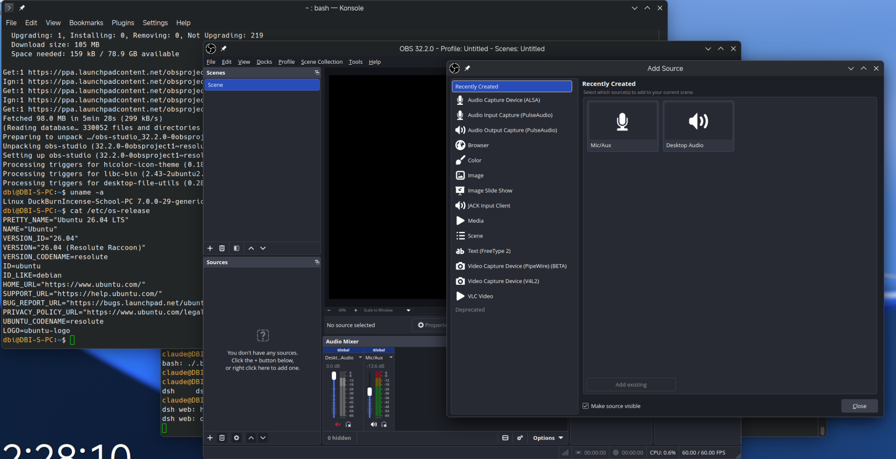
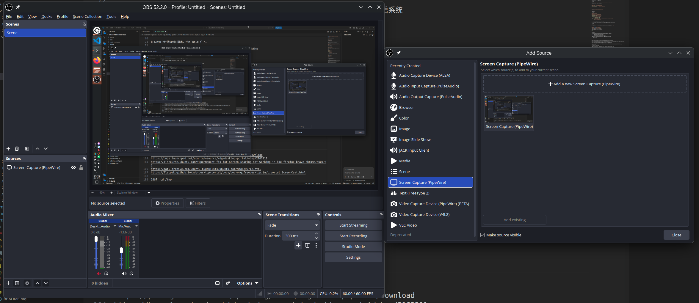
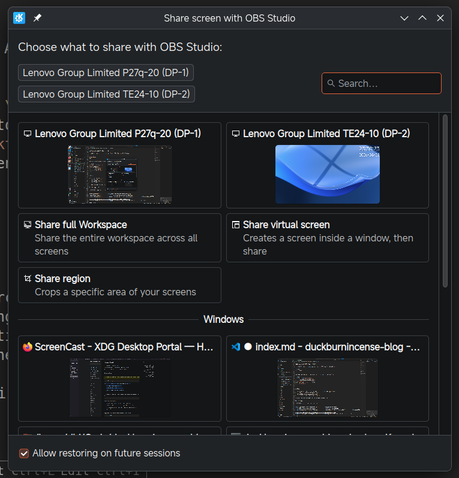

前阵子想用 OBS 录个屏，但是却发现 OBS 中连“屏幕捕获”（`Screen Capture (PipeWire)`）选项都不见了



随后经过大量排查，发现并不是 OBS 的问题，根据[文档](https://flatpak.github.io/xdg-desktop-portal/docs/doc-org.freedesktop.impl.portal.ScreenCast.html#org-freedesktop-impl-portal-screencast-availablesourcetypes)，使用 busctl 查询 XDG Desktop Portal 提供的 ScreenCast D-Bus 接口：

```bash
$ busctl --user get-property \
  org.freedesktop.portal.Desktop \
  /org/freedesktop/portal/desktop \
  org.freedesktop.portal.ScreenCast \
  AvailableSourceTypes
Failed to get property AvailableSourceTypes on interface org.freedesktop.portal.ScreenCast: No such interface “org.freedesktop.portal.ScreenCast”
```

结果竟然发现没有这个接口，那就很奇怪了，因为这意味着当前 xdg-desktop-portal 没有向 D-Bus 暴露 org.freedesktop.portal.ScreenCast 接口，因此 OBS 无法获取可用的 ScreenCast source。经过大量搜索，我发现这实际上是 xdg-desktop-portal 1.21.1+ds-1ubuntu3 的一个 bug：[Screen sharing not working in KDE (With a temp fix) ](https://bugs.launchpad.net/ubuntu/+source/xdg-desktop-portal/+bug/2163211)

按页面中的 workaround，降级 xdg-desktop-portal 到 1.20.3 即可临时解决该问题：

从 [Ubuntu Package Download Selection](https://packages.ubuntu.com/questing/amd64/xdg-desktop-portal/download) 下载旧版本 deb 包：

```bash
$ cd /tmp
$ wget https://security.ubuntu.com/ubuntu/pool/main/x/xdg-desktop-portal/xdg-desktop-portal_1.20.3+ds-1ubuntu1.1_amd64.deb
$ sha256sum xdg-desktop-portal_1.20.3+ds-1ubuntu1.1_amd64.deb
```

然后直接通过 apt 或 dpkg 安装：

```bash
sudo apt install ./xdg-desktop-portal_1.20.3+ds-1ubuntu1.1_amd64.deb
```

安装完成后，查询一下现在的包的版本：

```bash
$ dpkg-query -W xdg-desktop-portal
xdg-desktop-portal      1.20.3+ds-1ubuntu1.1
```

可以看到，确实降级成功。为了防止系统自动将其再次更新到存在 bug 的新版本，临时使用 apt-mark hold 住这个包，待 bug 修复后再解除 hold 并更新：

```bash
$ sudo apt-mark hold xdg-desktop-portal
```

检查一下：

```bash
$ apt-mark showhold
xdg-desktop-portal
$ apt policy xdg-desktop-portal
xdg-desktop-portal:
  Installed: 1.20.3+ds-1ubuntu1.1
  Candidate: 1.21.1+ds-1ubuntu3
  Version table:
     1.21.1+ds-1ubuntu3 500
        500 http://archive.ubuntu.com/ubuntu resolute/main amd64 Packages
 *** 1.20.3+ds-1ubuntu1.1 100
        100 /var/lib/dpkg/status
```

证实现在已经降级到旧版本，并且 hold 住了。

由于我们修改的包是 xdg-desktop-portal，使其生效的最稳妥方便的方式就是重启系统

```bash
sudo reboot
```

重启完成后，再次使用 busctl 查询 AvailableSourceTypes，已经存在并且为 `u 7`

```bash
$ busctl --user get-property \
 org.freedesktop.portal.Desktop \
 /org/freedesktop/portal/desktop \
 org.freedesktop.portal.ScreenCast \
 AvailableSourceTypes
u 7
```

根据文档：

> A bitmask of available source types. Currently defined types are:
> - 1: MONITOR: Share existing monitors
> - 2: WINDOW: Share application windows
> - 4: VIRTUAL: Extend with new virtual monitor

也就是说，目前 Monitor、Window、Virtual 三种捕获源都能正常工作了。

打开 OBS 验证一下：





参考资料：

- [ScreenCast - XDG Desktop Portal](https://flatpak.github.io/xdg-desktop-portal/docs/doc-org.freedesktop.impl.portal.ScreenCast.html)
- [Permanent fix for screen sharing not working in KDE (Firefox, Brave, Chrome) - #2 by ogra - Support and Help - Ubuntu Community Hub](https://discourse.ubuntu.com/t/permanent-fix-for-screen-sharing-not-working-in-kde-firefox-brave-chrome/86057/2)
- [[Bug 2163211] [NEW] Screen sharing not working in KDE (With a temp fix)](https://mail-archive.com/ubuntu-bugs@lists.ubuntu.com/msg6299712.html)
- [Bug #2163211 in xdg-desktop-portal (Ubuntu): "Screen sharing not working in KDE (With a temp fix)"](https://bugs.launchpad.net/ubuntu/+source/xdg-desktop-portal/+bug/2163211)
- [Ubuntu – Package Download Selection -- xdg-desktop-portal_1.20.3+ds-1ubuntu1.1_amd64.deb](https://packages.ubuntu.com/questing/amd64/xdg-desktop-portal/download)
